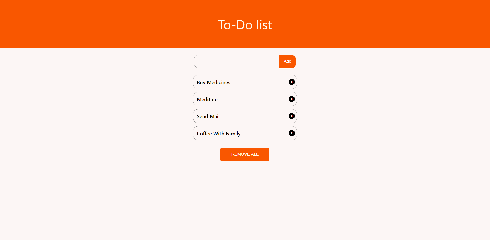

This project was bootstrapped with [Create React App](https://github.com/facebook/create-react-app).

A simple to-do app built using ReactJs 
## How to use

Clone the repo and run npm install to install all the 
dependencies.
### `yarn start`

Runs the app in the development mode. 
Open [http://localhost:3000](http://localhost:3000) to view it in the browser.

The page will reload if you make edits. 
You will also see any lint errors in the console.

  

